## 👨‍💻 Автор
**ФИО:** Здановский Даниил Станиславович  
**Группа:** 3МО-РИСКУ

---

## 🚀 Запуск проекта

### Клонирование репозитория:
```bash
git clone https://github.com/slarmick/Web
cd nginx-lab

### Запустить контейнеры:
```bash
docker-compose up -d --build
```

Открыть в браузере: http://localhost:8080 

📂 Содержимое проекта  
```docker-compose.yml``` — описание сервиса Nginx  
```code/index.html``` — главная HTML-страница  
```screenshots/``` — все скриншоты  

---

## Лабораторная работа №1
### Веб-сервер в Docker (Nginx + HTML)

**Цель:** Научиться поднимать веб-сервер Nginx в контейнере Docker

### Выполненные этапы:

#### Этап 1: Первый запуск Nginx
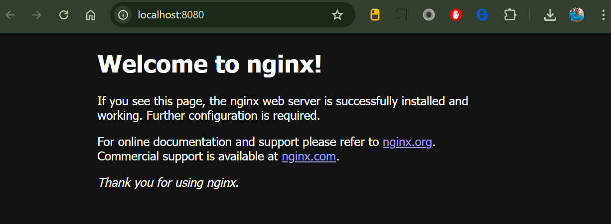

#### Этап 2: Кастомная страница
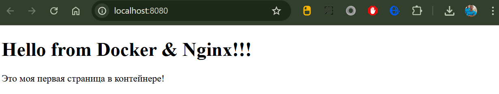

#### Этап 3: Страница "О нас"
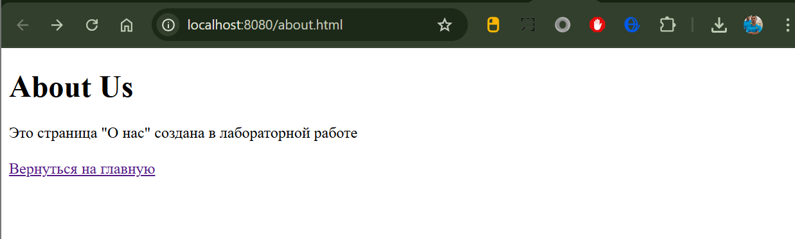

#### Этап 4: Добавление навигации
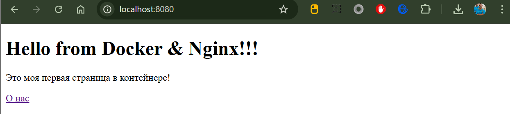

#### Этап 5: Работа на порту 3000
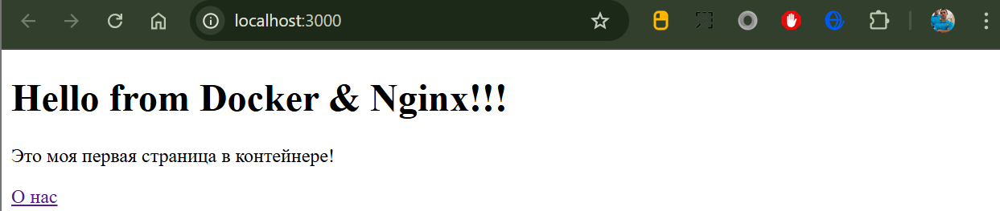

---

## Лабораторная работа №2
### Настройка Nginx + PHP-FPM. Основы HTML-форм и обработка на JavaScript.

**Цель:** 
- Научиться конфигурировать веб-сервер Nginx для работы с PHP через PHP-FPM
- Освоить базовые принципы PHP (на примере phpinfo())
- Повторить основы HTML: работа с формами, различными типами полей ввода
- Освоить базовую обработку форм с помощью JavaScript без перезагрузки страницы

### Выполненные этапы:

#### Этап 1: Добавление контейнера с PHP-FPM
- Настройка docker-compose с сервисами Nginx и PHP-FPM
- Настройка связки Nginx + PHP-FPM для обработки PHP файлов

#### Этап 2: Проверка работы PHP
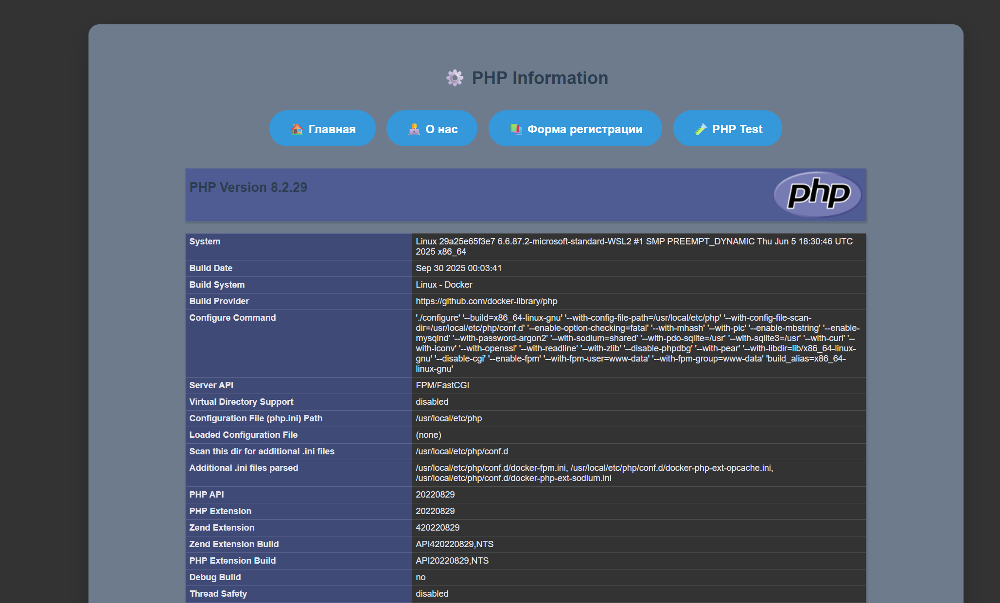
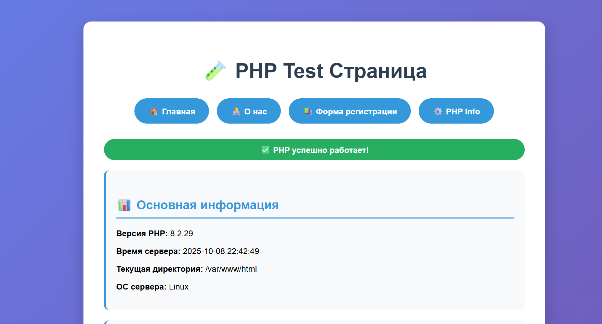

#### Этап 3: Создание HTML-формы
**Тема:** "Регистрация на мастер-класс"
- Текстовое поле: ФИО участника
- Поле даты: Дата рождения
- Выпадающий список: Тема мастер-класса
- Радио-кнопки: Формат участия (Онлайн/Очно)
- Чекбокс: Материалы включены
- Email поле: Email для связи

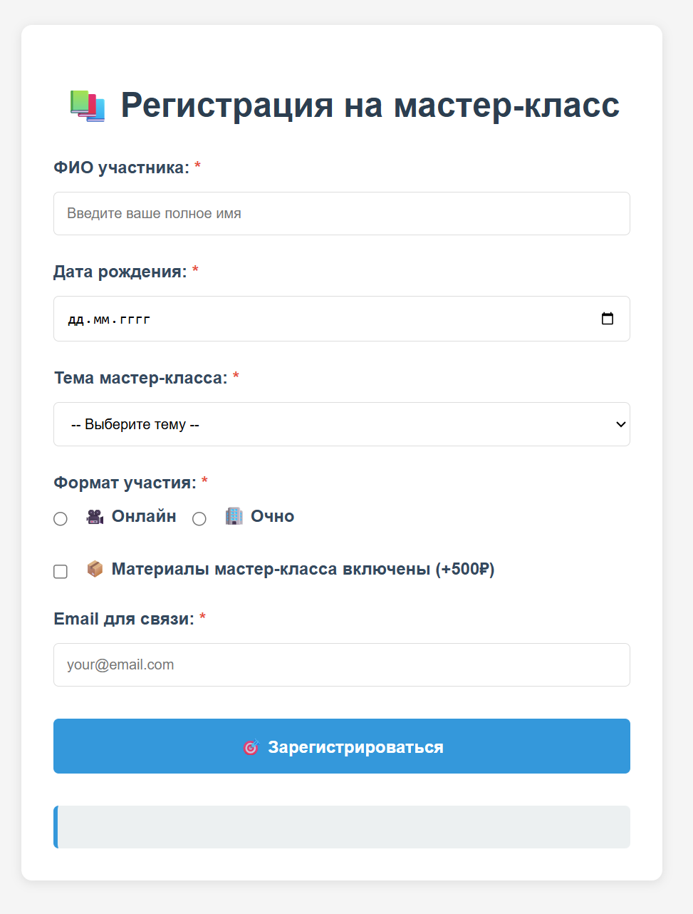

#### Этап 4: JavaScript обработка формы
- Обработка отправки формы без перезагрузки страницы
- Валидация данных на клиентской стороне
- Вывод результатов в красивом формате
- Плавная анимация при отображении результатов

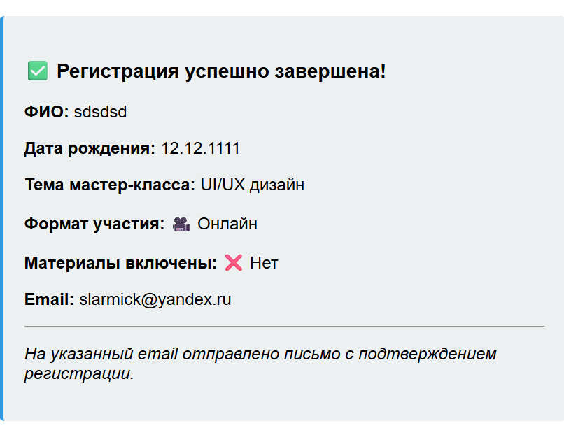

#### Этап 5: Единый стиль всех страниц
- Создание гармоничного дизайна для всех страниц
- Добавление навигации между всеми разделами
- Адаптивная верстка для разных устройств

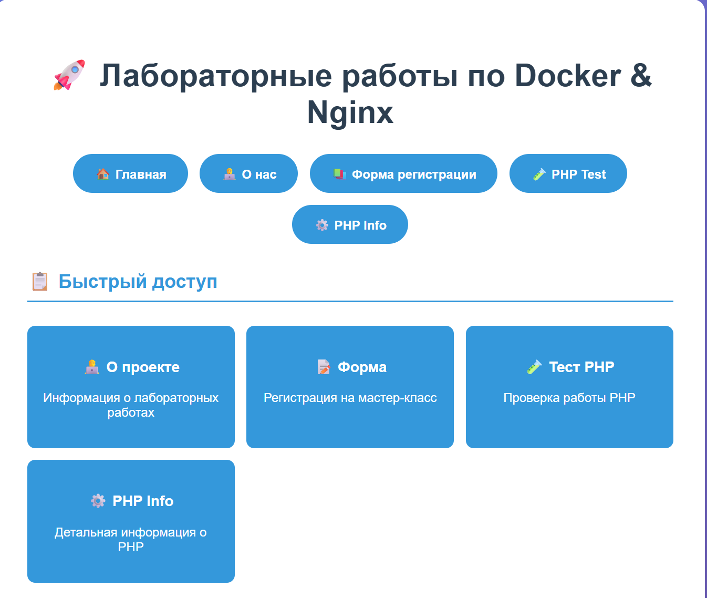
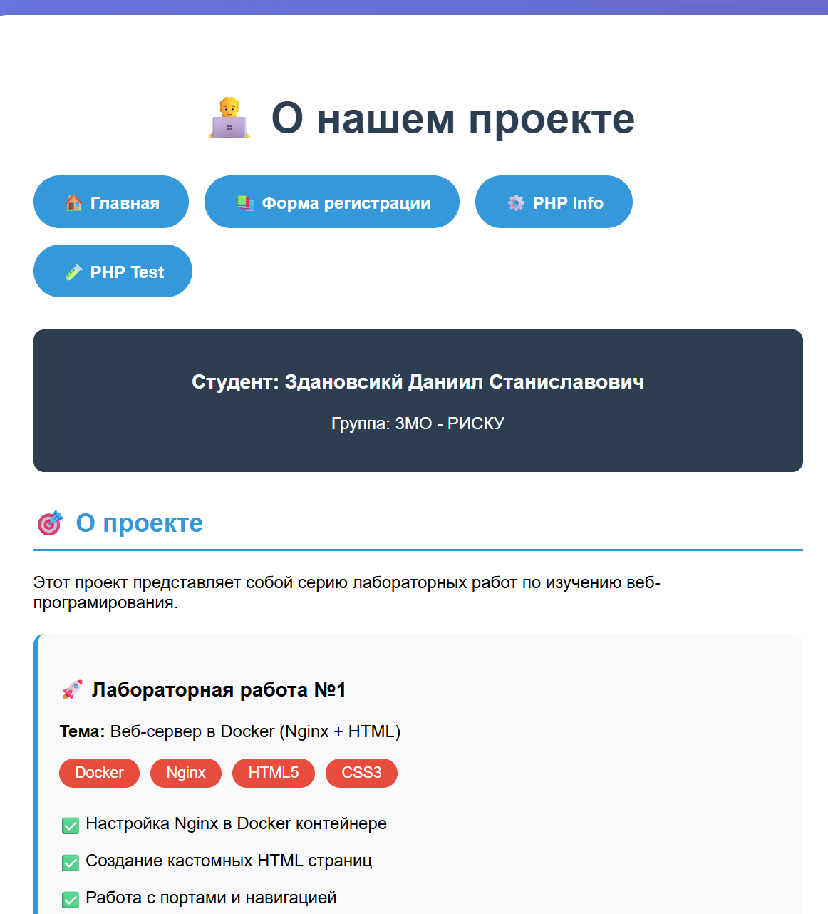

### Технологии использованные во второй лабе:
- 🐳 **Docker Compose** - оркестрация контейнеров
- 🌐 **Nginx 1.27** - веб-сервер с PHP-FPM
- 🐘 **PHP 8.2** - серверный язык программирования
- ⚡ **PHP-FPM** - FastCGI Process Manager
- 📝 **HTML5** - семантическая разметка
- 🎨 **CSS3** - стилизация и анимации
- ⚡ **JavaScript** - клиентская логика и валидация

---

## Лабораторная работа №3
### Обработка данных формы на PHP с сохранением в сессии и файл.

**Цель:** 
- Научиться обрабатывать данные формы на стороне сервера с помощью PHP
- Сохранять данные формы в сессии PHP
- Сохранять данные в файл и выводить их обратно на странице
- Научиться выводить все сохранённые данные в отдельной странице
- Реализовать валидацию данных на стороне сервера

### Выполненные этапы:

#### Этап 1: Создание PHP обработчика формы
- Создан process.php для обработки данных формы
- Реализована валидация данных на сервере:
	- Проверка обязательных полей
	- Валидация email
	- Проверка возраста (не менее 18 лет)
- Обработка ошибок с выводом пользовательских сообщений

#### Этап 2: Модификация формы для PHP обработки
- Форма master-class.html обновлена для отправки данных на PHP
- Добавлены action="process.php" и method="POST"
- Сохранен JavaScript alert для демонстрации введенных данных

#### Этап 3: Работа с сессиями PHP
- Реализован вывод данных из сессии после успешной отправки формы
- Вывод ошибок валидации с красивым оформлением

#### Этап 4: Сохранение данных в файл
- Данные сохраняются в файл data.txt в формате CSV
- Каждая запись содержит временную метку и все поля формы
- Реализована защита от перезаписи данных (FILE_APPEND)

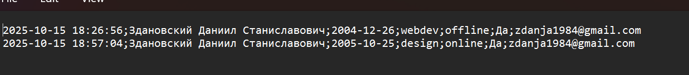

#### Этап 5: Просмотр всех данных
- Создана страница view.php для просмотра всех сохраненных записей
- Данные выводятся в виде таблицы с читаемым форматированием
- Реализована статистика по количеству записей

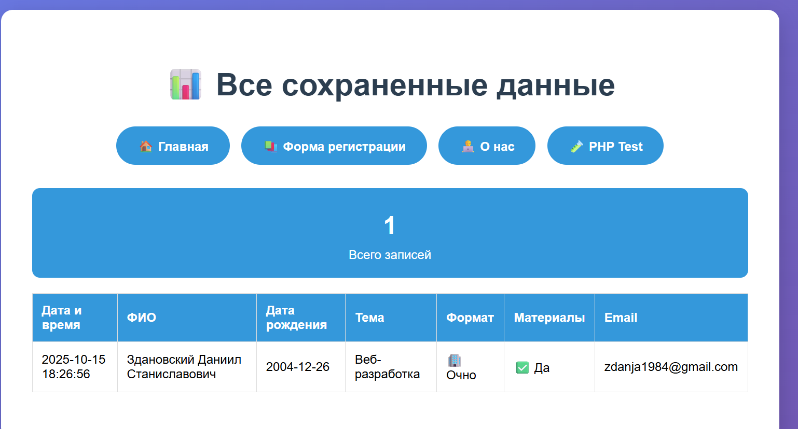

#### Этап 6: Навигация и интеграция
- Обновлена навигация между всеми страницами
- Добавлены ссылки на просмотр данных
- Единый стиль для всех страниц проекта

### Технологии использованные в третьей лабе:
- 🐘 **PHP 8.2 - серверная** обработка данных
- 🔐 **Сессии PHP - хранение** данных между запросами
- 📁 **Работа с файлами** - сохранение данных в текстовый файл
- ✅ **Валидация данных** - проверка корректности на сервере
- 🎨 **HTML5 + CSS3** - пользовательский интерфейс
- ⚡ **JavaScript** - клиентские уведомления
- 🐳 **Docker** - окружение для разработки

---

## Лабораторная работа №4
### Composer, классы и работа с публичным API

**Цель:**
- Освоить работу с Composer для управления зависимостями
- Научиться создавать PHP классы для организации кода
- Интегрировать внешнее публичное API в проект
- Работать с куками для хранения пользовательской информации
- Собирать информацию о браузере и IP-адресе пользователя

### Выполненные этапы:

#### Этап 1: Настройка Composer и зависимостей
- Инициализация проекта с Composer: `composer init`
- Установка Guzzle HTTP клиента: `composer require guzzlehttp/guzzle`
- Настройка автозагрузки классов через vendor/autoload.php

#### Этап 2: Создание класса ApiClient
- Реализация класса для работы с Art Institute of Chicago API
- Обработка HTTP запросов и ошибок через Guzzle
- Парсинг JSON ответов от API
- Резервные демо-данные на случай недоступности API

#### Этап 3: Создание класса UserInfo
- Сбор информации о пользователе (IP-адрес, браузер, время сервера)
- Работа с куками для отслеживания времени последней отправки формы
- Определение типа браузера пользователя
- Форматирование пользовательской информации

#### Этап 4: Интеграция API в процесс регистрации
- Вызов Art Institute API после успешной обработки формы
- Получение данных о художественных техниках (10 произведений)
- Сохранение данных API в сессии для отображения
- Автоматический редирект на страницу с результатами

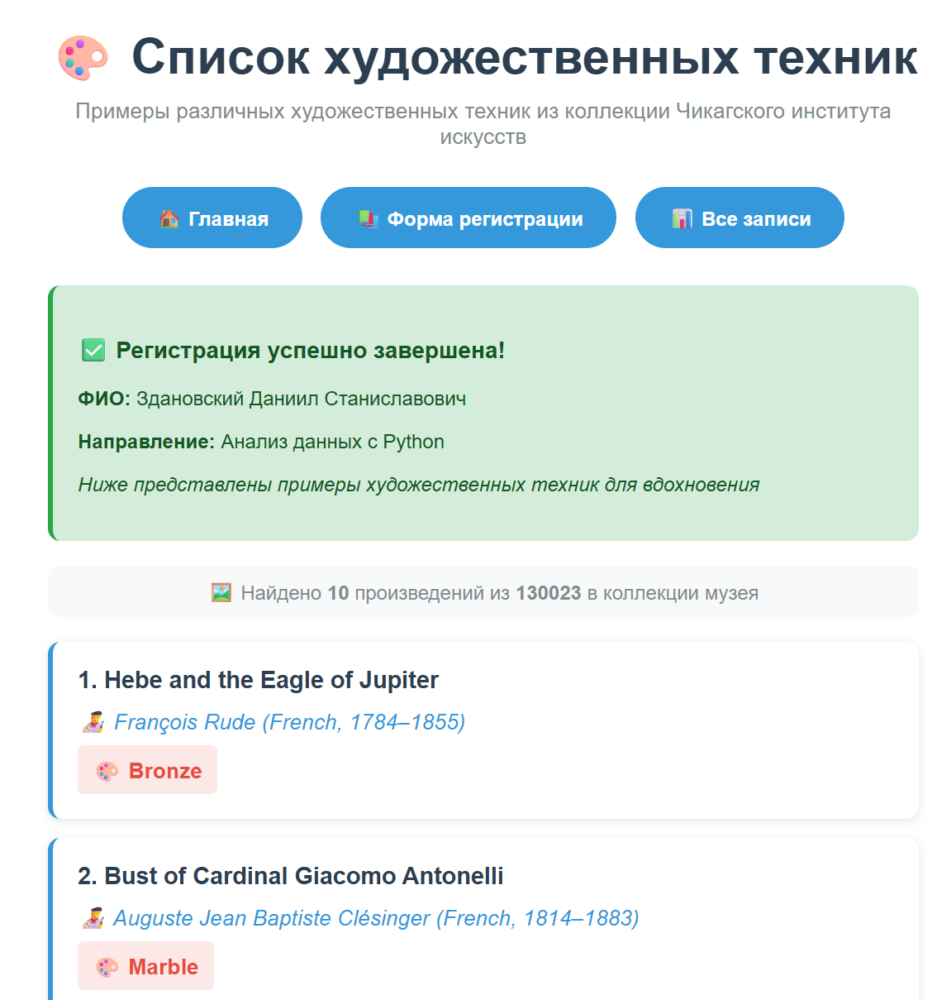

#### Этап 5: Создание страницы художественных техник
- Отдельная страница `techniques.php` для отображения результатов API
- Красивый список произведений искусства с названиями, авторами и техниками
- Анимация появления элементов при загрузке страницы
- Информация об успешной регистрации пользователя

#### Этап 6: Отображение пользовательской информации
- Вывод IP-адреса и информации о браузере на главной странице
- Отслеживание времени последней отправки формы через куки
- Единый стиль для всей пользовательской информации

### API Использовано:
- **Art Institute of Chicago API**: https://api.artic.edu/api/v1/artworks
- Получение данных о художественных произведениях
- Поля: название, автор, художественная техника
- Лимит: 10 произведений после каждой регистрации

### Технологии использованные в четвертой лабе:
- 🎯 **Composer** - менеджер зависимостей PHP
- 🌐 **Guzzle HTTP** - современный HTTP клиент для работы с API
- 🏛️ **REST API** - интеграция с Art Institute of Chicago API
- 🐘 **PHP Classes** - объектно-ориентированное программирование
- 🍪 **Cookies** - хранение пользовательской информации
- 🔧 **Сессии PHP** - передача данных между страницами
- 🎨 **CSS3 Animations** - плавные анимации интерфейса
- ⚡ **JavaScript** - клиентские взаимодействия

### Результат работы:
	После успешной регистрации на мастер-класс пользователь перенаправляется на страницу с списком художественных техник, где отображаются реальные произведения искусства из коллекции музея с их техниками выполнения. Это демонстрирует практическое использование внешнего API в веб-приложении.

---

## Лабораторная работа №5
### Работа с базой данных MySQL через PHP и Docker

**Цель:**
- Научиться работать с базой данных MySQL через PHP
- Создать таблицу для данных формы и сохранять данные в БД
- Выводить данные из базы на странице с возможностью управления
- Использовать классы PHP для работы с таблицей
- Работать с Docker контейнерами: nginx, PHP-FPM, MySQL, Adminer

### Выполненные этапы:

#### Этап 1: Настройка Docker Compose с MySQL и Adminer
- Добавление сервисов MySQL и Adminer в docker-compose.yml
- Создание Dockerfile для PHP с расширениями MySQL
- Настройка сетевого взаимодействия между контейнерами
- Конфигурация переменных окружения для БД

#### Этап 2: Создание классов для работы с базой данных
- Класс Database для управления подключением через PDO
- Класс MasterClassRegistration для CRUD операций с таблицей
- Автоматическое создание таблицы при инициализации
- Обработка ошибок подключения к БД

#### Этап 3: Интеграция БД в процесс обработки формы
- Модификация process.php для сохранения данных в БД и файл
- Сохранение обратной совместимости с предыдущими версиями
- Обработка ошибок при недоступности базы данных

#### Этап 4: Обновление страницы просмотра данных
- Вывод данных из MySQL базы данных и файла data.txt
- Реализация AJAX удаления записей через PHP обработчик
- Статистика по количеству записей в разных источниках
- Визуальное разделение данных из БД и файла

#### Этап 5: Настройка Adminer для управления БД
- Доступ к веб-интерфейсу Adminer на порту 8081
- Прямое управление таблицами и данными через браузер
- Выполнение SQL запросов и мониторинг базы данных

### Технологии использованные в пятой лабе:
- 🗄️ **MySQL 8.0** - реляционная система управления базами данных
- 🔌 **PDO (PHP Data Objects)** - безопасный доступ к БД через подготовленные запросы
- 🐳 **Docker Multi-Container** - оркестрация nginx, PHP-FPM, MySQL, Adminer
- ⚡ **AJAX** - асинхронное удаление записей без перезагрузки страницы
- 🎯 **CRUD Operations** - создание, чтение, обновление, удаление записей
- 🌐 **Adminer** - веб-интерфейс для управления базами данных
- 🔧 **PHP Classes** - объектно-ориентированная работа с БД

### Структура базы данных:
```sql
CREATE TABLE master_class_registrations (
    id INT AUTO_INCREMENT PRIMARY KEY,
    name VARCHAR(255) NOT NULL,
    birthdate DATE NOT NULL,
    topic VARCHAR(100) NOT NULL,
    format ENUM('online', 'offline') NOT NULL,
    materials ENUM('Да', 'Нет') NOT NULL,
    email VARCHAR(255) NOT NULL,
    created_at TIMESTAMP DEFAULT CURRENT_TIMESTAMP,
    updated_at TIMESTAMP DEFAULT CURRENT_TIMESTAMP ON UPDATE CURRENT_TIMESTAMP
);

### Результат работы:
	Создана полнофункциональная веб-система с сохранением данных в реляционную базу данных MySQL. Данные сохраняются как в БД (основное хранилище), так и в файл (для обратной совместимости). Реализован веб-интерфейс для просмотра и управления данными с возможностью удаления записей через AJAX. Система работает в Docker-окружении с изолированными сервисами nginx, PHP-FPM, MySQL и Adminer.

---

## Лабораторная работа №6
### Нереляционные базы данных (Redis, Elasticsearch, ClickHouse) и взаимодействие через API

**Цель:**
- Изучить нереляционные базы данных (Redis, Elasticsearch, ClickHouse)
- Настроить многоконтейнерную среду с различными базами данных
- Взаимодействовать с базами данных через HTTP API с помощью GuzzleClient
- Реализовать различные сценарии использования NoSQL БД
### Выполненные этапы:

#### Этап 1: Настройка Docker Compose с NoSQL базами
- Добавление сервисов Redis, Elasticsearch, ClickHouse в docker-compose.yml
- Настройка сетевого взаимодействия между всеми контейнерами
- Конфигурация портов и переменных окружения для каждой БД

#### Этап 2: Создание классов для работы с NoSQL базами
- Класс RedisExample для работы с ключ-значение хранилищем через REST API
- Класс ElasticExample для поиска и индексации документов
- Класс ClickhouseExample для аналитических запросов
- ClientFactory для создания унифицированных HTTP клиентов

#### Этап 3: Реализация Redis Dashboard
- Создание страницы redis-dashboard.php для мониторинга Redis
- Функции для установки, получения и удаления значений
- Визуализация данных Redis в реальном времени
- Управление ключами через веб-интерфейс

### Технологии использованные в пятой лабе:
- 🔴 **Redis 7** - in-memory key-value хранилище
- 🌐 **Guzzle HTTP** - взаимодействие с базами через REST API
- 🏗️ **Client Factory Pattern** - унифицированный подход к работе с API
- 📊 **Redis Dashboard - веб-интерфейс для мониторинга Redis
- 🔧 **PHP Classes** - объектно-ориентированная работа с NoSQL БД

### Результат работы:
	Создана комплексная система работы с нереляционными базами данных через HTTP API. Реализован Redis Dashboard для мониторинга и управления данными в реальном времени. Система демонстрирует практическое применение различных NoSQL технологий для решения специфических задач: Redis для быстрого доступа к данным, Elasticsearch для поиска и анализа, ClickHouse для аналитики больших объемов данных. Все компоненты работают в едином Docker-окружении.